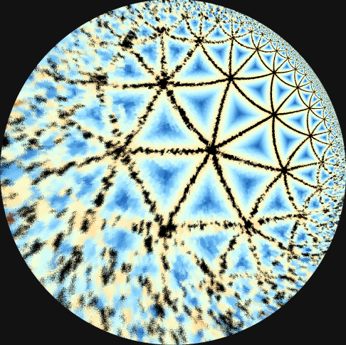

# HyperDiffusionChess

自创规则的棋

Hyper Diffusion: 双方轮流放置棋子, 不能放置在4个以及以上的相邻的棋子旁边. 当放置的棋子构成多于等于4个棋子相邻时, 该玩家必须继续放置棋子. 须放置却没有空位置的玩家输.

目前状况: 实现了 本地对战和网络对战, {3,7}镶嵌的双曲棋盘, 9路围棋棋盘, AI对手(随机落子ai和蒙特卡洛ai)

待实现: 蜂巢棋盘, 三角棋盘

https://zhaouv.github.io/HyperDiffusionChess/play.html

(此演示页面未配置服务器, 仅可进行本地对战)

- "Square"
- "Hexagonal"
- "Quadrilateral"

# License

尚未添加

# Notice

{3,7} 镶嵌参考了 https://github.com/zenzicubic/curvascope.git 和 https://github.com/JRzymkowski/Heptagonal-Tiling.git

9路棋盘参考了 https://github.com/0522skylar/svg_vs_canvas_chess/
(还未实装)

